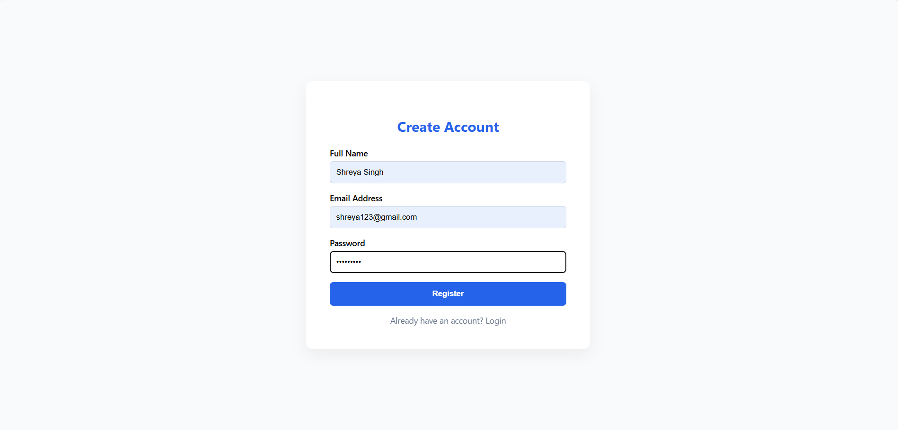
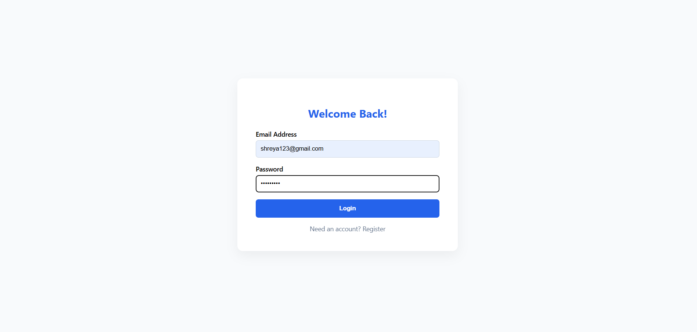
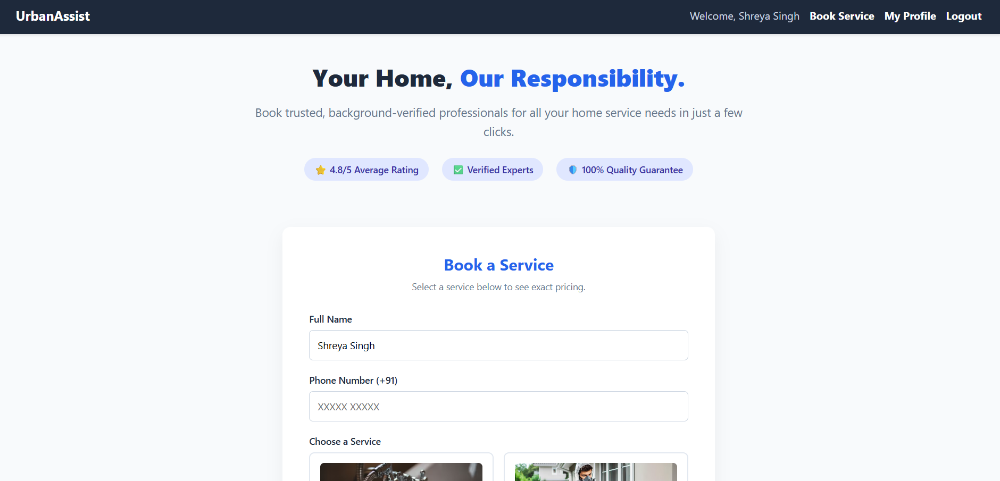

# Smart Service Booking System

## Description
This project is developed for final year submission.

## Technologies Used
- HTML
- CSS
- JavaScript
- PHP
- MySQL

## Features
- User login
- Service booking
- Admin panel
- Admin Dashboard
- Booking Management
- Database Integration

## How to Run
1. Download or clone the repository
2. Move project folder to htdocs (XAMPP)
3. Start Apache & MySQL
4. Import database.sql into phpMyAdmin
5. Open browser and run:
http://localhost/service_booking

## Screenshots
### Registration Page

### Login Page

### Services Dashboard Page

## Author
Prerana Verma

