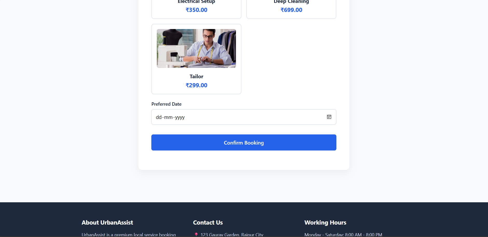
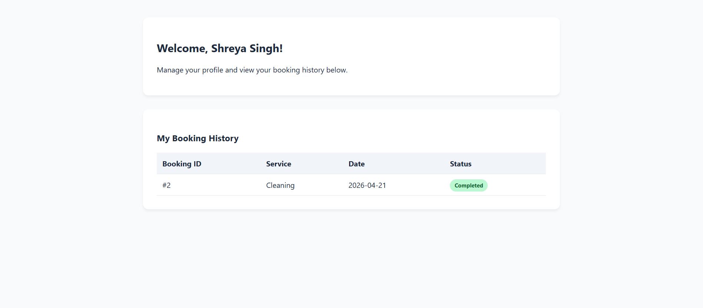
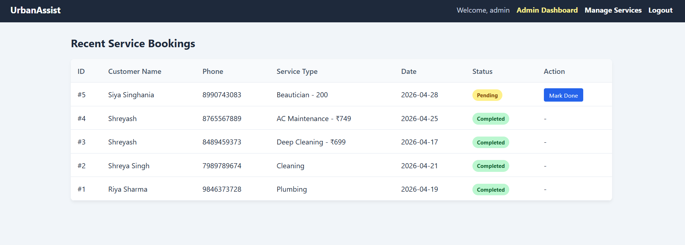
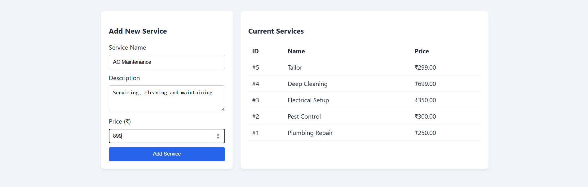
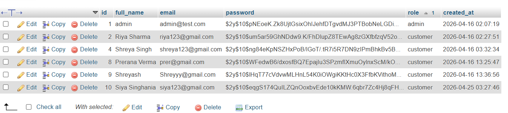
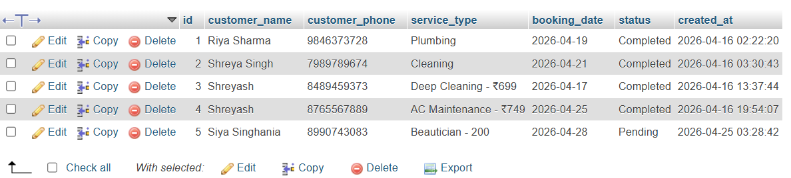

# Smart Service Booking System

## Description
The Smart Service Booking System is a web-based application developed as a final year project.
It helps users book various services online easily and efficiently.

## Technologies Used
- HTML
- CSS
- JavaScript
- PHP
- MySQL

## Features
- User login
- Service booking
- Admin panel
- Admin Dashboard
- Booking Management
- Database Integration

## How to Run
1. Download or clone the repository
2. Move project folder to htdocs (XAMPP)
3. Start Apache & MySQL
4. Import database.sql into phpMyAdmin
5. Open browser and run:
http://localhost/service_booking

## Screenshots
### Registration Page

### Login Page

### Services Dashboard Page

### Booking page

### Customer Profile 

### Admin Login Page

### Admin Dashboard Page

### Admin Manage Services Page

### Database Users Table 

### Database Bookings Table 

## Author
Prerana Verma

## License
This project is developed for educational and academic purposes only.
